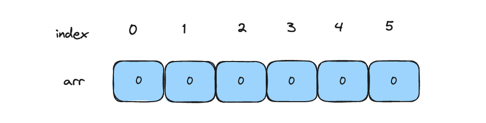
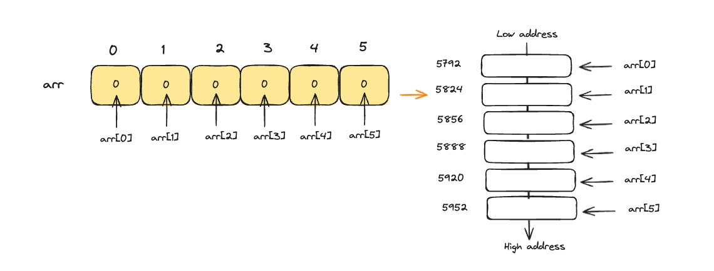
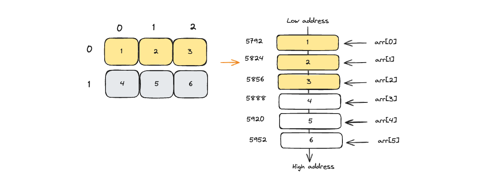
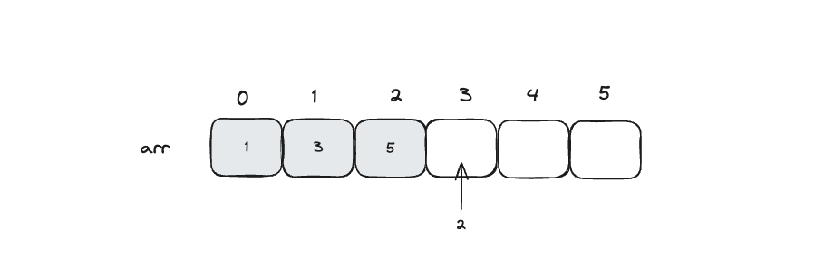
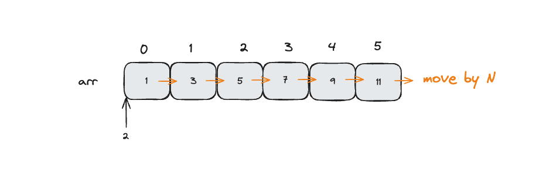
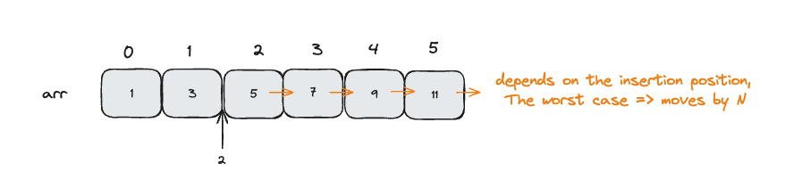

import { Callout, Steps } from 'nextra/components'
import Image from 'next/image'

# 배열

<Steps>
  ### 01 배열
  배열은 `인덱스와 값을 일대일 대응해 관리하는 자료구조`입니다.<br/>
  데이터를 저장할 수 있는 모든 공간은 인덱스와 일대일 대응하므로 어떤 위치에 있는 데이터는 한번에 접근할 수 있습니다.

  <Callout type="info" emoji="💡">
    어디에 있는지만 안다면! 빠르게 탐색이 가능해요. 데이터를 한번에 접근할 수 있으니까요.<br/>
    이러한 접근 방식을 임의 접근(random access)라고 부릅니다.
  </Callout>

  #### 배열 선언
  이름이 arr이고 길이가 6인 정수열 배열을 선언한 코드는 아래와 같고 1, 2번 라인의 코드 모두 결괏값이 동일합니다.<br/>
  즉, 자바에서 int형 배열의 경우 기본값을 0으로 초기화합니다. 선언한 코드는 아래 그림처럼 컴퓨터에 저장됩니다.

  ```java showLineNumbers copy
    int[] arr = {0, 0, 0, 0, 0, 0};
    int[] arr = new int[6];
  ```

  

  #### 배열과 차원
  배열은 2차원, 3차원 배열과 같이 다차원 배열을 사용할 때도 많습니다.<br/>
  구조는 다차원이지만! 실제로는 1차원 공간에 저장합니다. 차원과 무관하게 메모리에 연속 할당되어 저장됩니다. <br/>
  어떻게 그게 가능하냐구요? 아래 그림과 함께 설명해보겠습니다.

  1차원 배열은 해당 모습이 메모리에 할당된 실제 배열의 모습과 같습니다.<br/>
  그래서 가장 간단한 배열 형태를 가집니다. 아래 그림을 한번 보시죠! <br/><br/>
  <br/><br/>

  아래 2차원 배열의 경우는 어떻게 저장될까요?
  왼쪽은 2차원 배열을 사람이 이해하기 쉽도록 2차원으로 표현한 것이고, <br/>
  오른쪽은 실제 메모리에 2차원 배열이 저장된 상태를 표현한 것입니다.<br/>
  실제로는 오른쪽처럼 0행, 1행 순서로 데이터를 할당해 1차원 공간에 저장합니다!
  ```java showLineNumbers copy
  int[][] arr = {{1, 2, 3}, {4, 5, 6}};
  ```
  

  <br/>
  ### 02 ArrayList
  자바에는 배열과 유사한 기능을 가진 자료구조 ArrayList가 있습니다. 두개의 차이점은 무엇일까요?<br/>
  `배열의 크기`를 결정하는 방법이 다릅니다. 배열은 처음 선언할 때 배열의 크기가 결정되고, ArrayList는 크기가 동적입니다.<br/>
  (엄밀히 말하면 ArrayList도 초기에 크기가 결정되지만 동적으로 변하는 것처럼 구현되어 있습니다.)

  <Callout type="warning" emoji="⚠️">
    그러면 배열과 ArrayList는 각각 어느 상황에 사용하는 것이 효율적일까요?
  </Callout>

  #### 사용법
  <b>1. add() 메서드로 데이터 추가</b>
  ```java showLineNumbers copy
  ArrayList<Integer> list = new ArrayList<>();

  // 리스트의 맨 끝부터 데이터 추가
  list.add(1);
  list.add(2);
  list.add(3);
  ```
  <br/>
  <b>2. 다른 컬렉션의 데이터로부터 초기화</b>
  ```java showLineNumbers copy
  ArrayList<Integer> list = new ArrayList<>();

  // 리스트의 맨 끝부터 데이터 추가
  list.add(1);
  list.add(2);
  list.add(3);

  // ArrayList의 매개변수로 컬렉션을 넘기면 매개변수로 넘긴 컬렉션에 담긴 데이터로 초기화!
  ArrayList<Integer> list2 = new ArrayList<>(list);
  System.out.println(list2); // [1, 2, 3]
  ```
  <br/>
  <b>3. get() 메서드로 인덱스를 통해 데이터에 접근</b>
  ```java showLineNumbers copy
  ArrayList<Integer> list = new ArrayList<>();

  // 리스트의 맨 끝부터 데이터 추가
  list.add(1);
  list.add(2);
  list.add(3);

  System.out.println(list.get(1)); // 2
    ```
  <br/>
  <b>4. remove() 메서드로 데이터 삭제</b>
  ```java showLineNumbers copy
  ArrayList<Integer> list = new ArrayList<>();

  // 리스트의 맨 끝부터 데이터 추가
  list.add(1);
  list.add(2);
  list.add(3);

  list.remove(list.size() - 1); // 끝에 있는 데이터 삭제
  System.out.println(list); // [1, 2]
    ```
  <Callout type="info" emoji="ℹ️">
    위에 나열한 메서드 말고도 다양한 메세드를 제공합니다.(배열 변수 : arr, ArrayList 변수 : list)<br/>
    arr.length, Arrays.sort(arr), Arrays.toString(arr), list.size(), list.isEmpty(), Collections.sort(list)
  </Callout>
  <Callout type="error" emoji="️🚫">
    remove() 메서드의 경우 데이터를 삭제하는 위치에 따라 데이터를 복사하는 연산이 필요해<br/>
    시간 복잡도가 O(N)까지 증가할 수 있어 주의가 필요합니다.
  </Callout>
  
  <br/>

  ### 03 ArrayList 효율성
  배열은 임의 접근이라는 방법으로 배열이 모든 위치에 있는 데이터에 단번에 접근할 수 있습니다.<br/>
  따라서 시간복잡도는 O(1)입니다. 배열에 데이터를 추가하는 경우는 어떨까요? 어디에 저장하느냐에 따라 시간복잡도가 달라집니다!

  #### 맨 뒤에 삽입할 경우
  아래와 같은 배열에 맨뒤에 2를 추가한다고 해봅시다. <br/>
  arr[3]에 바로 접근할 수 있으며, 데이터를 삽입해도 다른 데이터 위치에 영향을 주지 않기 때문에 `O(1)`의 시간 복잡도를 가집니다.
  ```java showLineNumbers copy
  ArrayList<Integer> list = new ArrayList<>(Arrays.asList(1, 3, 5));

  list.add(2);
  ```
  

  #### 맨 앞에 삽입할 경우
  아래와 같은 배열에 맨 앞에 2를 추가한다고 해봅시다. <br/>
  이 경우 기존 모든 데이터들을 뒤로 한 칸씩 밀어야합니다. 데이터 개수를 N개로 일반화하면 시간 복잡도는 `O(N)`을 가집니다.
  ```java showLineNumbers copy
  ArrayList<Integer> list = new ArrayList<>(Arrays.asList(1, 3, 5, 7, 9, 11));

  list.add(0, 2);
  ```
  

  #### 중간에 삽입할 경우
  아래와 같은 배열 중간, 5 숫자 앞에 2를 추가한다고 해봅시다. <br/>
  5 이후의 데이터를 한 칸씩 밀어야 합니다. 최악의 경우 모든 데이터를 밀어야하는 경우가 생기기 때문에 `O(N)`의 시간 복잡도를 가집니다.
  ```java showLineNumbers copy
  ArrayList<Integer> list = new ArrayList<>(Arrays.asList(1, 3, 5, 7, 9, 11));
  list.add(2, 2);
  ```
  

  위 예시를 통해 우리는 특정 경우에 배열이 추가/삭제시 많은 비용이 든다는 사실을 알았습니다!<br/>
  그래서 문제를 풀기 전 항상 이런 비용을 생각하는 것이 좋습니다.

  ### 04 배열을 선택할 때 고려할 점
  데이터에 자주 접근하거나 읽어야 하는 경우 배열을 사용하면 좋은 성능을 낼 수 있습니다.<br/>
  예를 들어 그래프를 표현할 때 배열을 활용하면 임의 접근을 할 수 있어 간선여부도 시간 복잡도 O(1)로 판단할 수 있습니다.<br/>
  단, 배열은 메모리 공간을 충분히 확보해야하는 단점이 있습니다. 아래 사항을 고려해 배열을 선택해야 합니다.<br/><br/>

  <ol>
    <li><b>1. 할당할 수 있는 메모리 크기 확인</b></li><br/>
    <li>배열로 표현하려는 데이터가 너무 많으면 런타임에서 배열 할당 실패가 발생할 수 있습니다.<br/>
      OS마다 다르지만 보통 정수형 1차원 배열은 1000만 개, 2차원 배열은 3000 * 3000 크기를 최대로 생각하면 됩니다.</li><br/>
    <li><b>2. 중간에 데이터 삽입이 많은지 확인</b></li><br/>
    <li>배열은 선형 자료구조이기 때문에 중간이나 처음에 데이터를 빈번하게 삽입하면<br/>
      시간 복잡도가 높아져 실제 시험에서 시간 초과가 발생할 수 있습니다.</li>
  </ol>

</Steps>