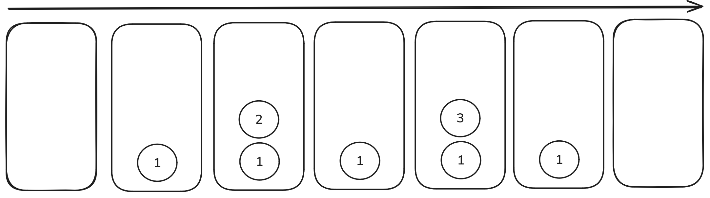

import { Callout, Steps } from 'nextra/components'
import Image from 'next/image'

# 스택

<Steps>
  ### 01 스택 개념
  스택은 먼저 입력한 데이터를 제일 나중에 꺼낼 수 있는 자료구조입니다.<br/>
  FILO(First In Last Out), 선입후출은 스택과 같이 먼저 들어간 것이 마지막에 나오는 규칙이라고 합니다.<br/>
  스택에 삽입하는 연산을 푸시(push), 꺼내는 연산을 팝(pop)이라고 합니다.<br/>

  #### 스택의 동작 원리

  

  1. 초기의 빈 스택이 있습니다.
  2. 데이터 1을 푸시합니다.
  3. 데이터 2를 푸시합니다.
  4. 팝을 합니다.
  5. 데이터 3을 푸시합니다.
  6. 팝을 합니다.
  7. 팝을 합니다.

  ### 02 스택의 정의
  스택의 ADT라는 것을 정의해보겠습니다.<br/>

  <Callout type="info" emoji="💡">
    ADT는 우리말로 추상 자료형입니다. 이는 인터페이스만 있고 실제로 구현은 되지 않은 자료형을 뜻합니다.<br/>
    쉽게 설명하자면 자료형의 설계도 입니다.
  </Callout>

  #### 스택의 ADT
  스택을 쓰기 위해서는 연산을 하거나 상태를 나타내는 코드를 정의해야합니다.

  - 연산
    - `isFull()` - 가득 찼는지 확인합니다.
    - `isEmpty()` - 스택에 데이터가 하나도 없는지 확인합니다.
    - `push()` - 스택에 데이터를 푸시합니다.
    - `pop()` - 스택에 팝을 하고 그 데이터를 반환합니다.
  - 상태
    - `top()` - 스택에서 최근에 푸시한 데이터의 위치를 반환합니다.

  <Callout type="info" emoji="❓">
    ADT만 알면 되고 세부 구현은 몰라도 될까요?<br/>
    아닙니다. 코딩테스트에서 스택문제인지 다른 알고리즘을 써야하는지 알려주지 않기 때문에 세부 구현을 알아두는 것이 좋습니다. 또한 면접에서도 큰 도움이 됩니다.
  </Callout>

  #### 스택 더 자세히 알아보기

  `push(3)`의 내부 동작에 대해 알아봅시다.

  1. `isFull()` 을 수행해 데이터가 가득 찼는지 확인합니다.
  2. 그렇지 않다면 `top`을 1만큼 증가시킨 뒤 `top`이 가리키는 위치에 데이터 3을 추가합니다.
  
  다음으로, `pop()`의 내부 동작에 대해 알아봅시다.

  1. `isEmpty()` 함수를 우선 수행해 스택이 비어있는지 확인합니다.
  2. 데이터가 있다면 `top`을 1만큼 감소시키고 데이터 3을 반환 합니다.

  #### Stack 클래스 사용하기

  ```java
  // 스택 객제 생성
  Stack<Integer> stack = new Stack<>();

  // 스택에 데이터 푸시
  stack.push(1);
  stack.push(2);

  // 스택이 비어있는지 확인
  System.out.println(stack.isEmpty()); // false

  System.out.println(stack.pop()); // 3
  System.out.println(stack.pop()); // 1
  System.out.println(stack.isEmpty); // true
  ```

  자바의 `Stack` 클래스는 크기를 동적으로 관리하므로 `max_size` 나 `isFull()` 메서드는 없습니다. 하지만 `size()` 나 `peek()` 메서드를 사용할 수 있습니다.<br/>
  스택은 어렵지 않지만 스택을 사용해야하는지 몰라서 못푸는 문제가 있을 수 있습니다.<br/>
  **따라서 스택 관련 문제를 많이 풀어보며 ‘이 문제는 스택을 사용하는 것이 좋겠다’라는 감을 익히기를 권장합니다.**<br/>
</Steps>
