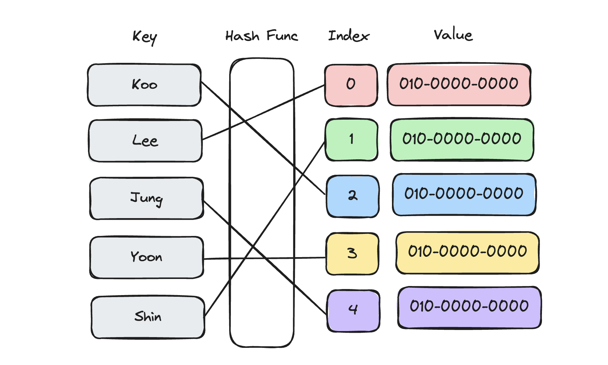

import { Callout, Steps } from 'nextra/components'

<Steps>
  ### 01 해시
  데이터를 효율적으로 저장하고, 탐색하는 것은 현대사회에서 매우 중요합니다!<br/>

  <Callout type="info" e시oji="💡">
    <b>Q. 어떤 데이터를 찾는다고 했을 때 쉽게 떠올려 볼 수 있는 방법은 무엇일까요?</b><br/>
    처음부터 끝까지 순차 탐색하는 방법이 있겠죠!<br/>
    하지만 최약의 경우 탐색할 때마다 모든 데이터를 살펴봐야합니다.
  </Callout>

  순차 탐색을 개선하기 위해, 찾아야 할 값이 어디에 있는지 알아낼 방법이 필요합니다.<br/>
  이 생각을 바탕으로 만들어진 자료구조가 `해시(Hash)` 입니다.<br/>

  해시는 <b>해시 함수를 사용해서 변환한 값을 인덱스로 삼아 키와 값을 저장해서 빠른 데이터 탐색을 제공하는 자료구조</b>입니다.<br/>

  

 ### 02 해시의 특징
 - `단방향`으로 동작<b>(키를 통해 값을 찾을 수 있지만, 값을 통해 키를 찾을 수는 없음)</b>
 - 찾고자 하는 값을 `O(1)`에서 바로 찾음<b>(키 자체가 해시 함수에 의해 값이 있는 인덱스가 되므로, 값을 찾기 위한 탐색 과정 불필요)</b>
 - 값을 인덱스로 활용하려면 `적절한 변환 과정` 필요

해시는 주로 <b>비밀번호 관리, 데이터베이스 인덱싱, 블록체인(데이터 무결성)</b>과 같은 분야에서 활용됩니다.


 ### 03 해시 사용 방법
  ```java showLineNumbers copy
  HashMap<String, Integer> hashMap = new HashMap<>();

  // 1. 해시맵에 데이터 저장
  hashMap.put("ABC", 10);
  hashMap.put("BBB", 20);
  hashMap.put("AAA", 30);
  hashMap.put("ABC", 15);

  // 2. 해시맵안에 데이터가 없다면 true, 있다면 false
  System.out.println(hashMap.isEmpty());

  // 2. key에 대한 value 값 반환
  System.out.println(hashMap.get("ABC"));

  // 3. 해당 key가 있다면 true, 없다면 false
  System.out.println(hashMap.containsKey("ABC"));

  // 4. key에 해당하는 데이터 삭제
  hashMap.remove("ABC");

  // 5. 해시맵 안에 있는 데이터의 개수 반환
  System.out.println(hashMap.size());

  // 6. 모든 데이터 삭제
  hashMap.clear();
  System.out.println(hashMap.isEmpty());
```

  </Steps>