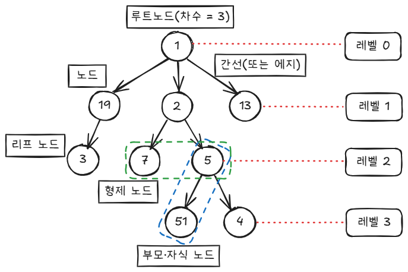
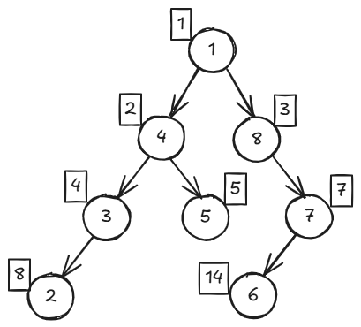
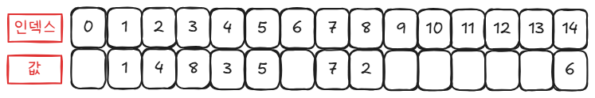
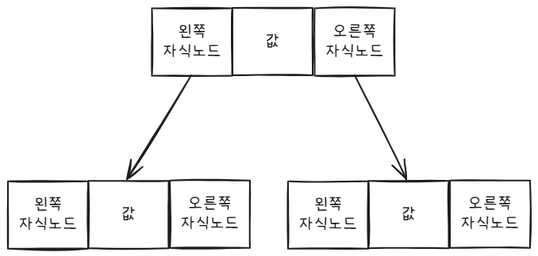
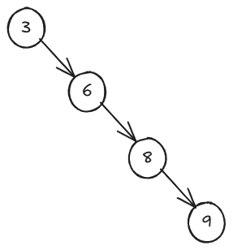

import { Callout, Steps } from 'nextra/components'

#트리

<Steps>
  ### 01 트리 개념
  트리는 데이터를 저장하고 탐색하기에 유용한 구조로, 프로그래밍에서 계층 구조를 표현하는 데 자주 사용됩니다. <br/>
  트리는 마치 나무를 거꾸로 뒤집어 놓은 형태와 비슷합니다.

  <Callout type="info" emoji="🌳">

  

  - **노드**: 트리를 구성하는 기본 요소로, 가장 위에 있는 노드를 **루트 노드**라고 합니다.
  - **에지**: 노드 간의 연결을 의미하며, 트리의 경로는 루트 노드에서 각 노드까지 유일합니다.
  - **부모·자식 관계**: 간선으로 연결된 노드 간의 관계를 나타냅니다.
  - **리프 노드**: 자식이 없는 노드를 의미합니다.
  - **차수**: 특정 노드가 가지는 자식 노드의 수를 뜻합니다.

  ### 02 이진 트리 표현하기
  이진 트리는 배열 또는 포인터를 사용하여 구현할 수 있습니다.

  <Callout type="info" emoji="💡">
    배열로 이진 트리를 표현할 때, 루트 노드는 인덱스 1번에 저장하며, 왼쪽 자식은 부모 인덱스 × 2, 오른쪽 자식은 부모 인덱스 × 2 + 1입니다.
  </Callout>

  
  

  - **배열 표현 예시**: 효율적인 메모리 관리가 가능하지만, 공간 낭비가 발생할 수 있습니다.

  
  - **포인터 표현**: 각 노드가 왼쪽과 오른쪽 자식을 가리키는 구조로 유연하게 표현할 수 있습니다.

  ### 03 이진 트리 순회
  이진 트리를 순회하는 방법에는 **전위, 중위, 후위 순회**가 있습니다.

  - **전위 순회 (Preorder)**: 루트 → 왼쪽 자식 → 오른쪽 자식
  - **중위 순회 (Inorder)**: 왼쪽 자식 → 루트 → 오른쪽 자식
  - **후위 순회 (Postorder)**: 왼쪽 자식 → 오른쪽 자식 → 루트

  ### 04 이진 탐색 트리
  이진 탐색 트리는 효율적인 탐색이 가능하도록 데이터를 정렬하여 삽입하는 구조입니다.

  <Callout type="info" emoji="🔍">
    이진 탐색 트리는 데이터가 균형 있게 분포할 때, 탐색과 삽입 연산이 **O(logN)** 복잡도를 가집니다. 그러나 트리가 한쪽으로 치우치면 **O(N)**이 될 수 있습니다.
  </Callout>

  


  ```java showLineNumbers copy
  // 이진 탐색 트리 코드
  // 각 노드를 정의하는 클래스
  class Node {
      int data; // 노드에 저장되는 값
      Node left, right; // 왼쪽 및 오른쪽 자식 노드를 가리키는 변수

      // 생성자: 새 노드를 생성할 때 값을 초기화하고, 자식 노드를 null로 설정
      public Node(int item) {
          data = item; // 전달받은 item 값을 data에 저장
          left = right = null; // 자식 노드는 처음에는 null로 설정
      }
  }

  // 이진 탐색 트리 클래스
  class BinaryTree {
      Node root; // 이진 탐색 트리의 루트 노드

      // 트리에 새로운 키를 추가하는 메소드
      void insert(int key) {
          root = insertRec(root, key); // 재귀적으로 삽입을 수행
      }

      // 재귀적으로 노드를 삽입하는 헬퍼 메소드
      Node insertRec(Node root, int key) {
          // 현재 서브트리가 비어 있으면 새로운 노드를 생성하고 반환
          if (root == null) {
              root = new Node(key); // 새 노드를 생성하여 반환
              return root; // 삽입된 노드를 반환
          }

          // 삽입할 키가 현재 루트의 값보다 작으면 왼쪽 서브트리에 삽입
          if (key < root.data) {
              root.left = insertRec(root.left, key); // 왼쪽 자식에 대해 재귀적으로 호출
          }
          // 삽입할 키가 현재 루트의 값보다 크면 오른쪽 서브트리에 삽입
          else if (key > root.data) {
              root.right = insertRec(root.right, key); // 오른쪽 자식에 대해 재귀적으로 호출
          }

          // 현재 루트를 반환 (트리의 구조를 유지)
          return root;
      }
  }
```

</Steps>